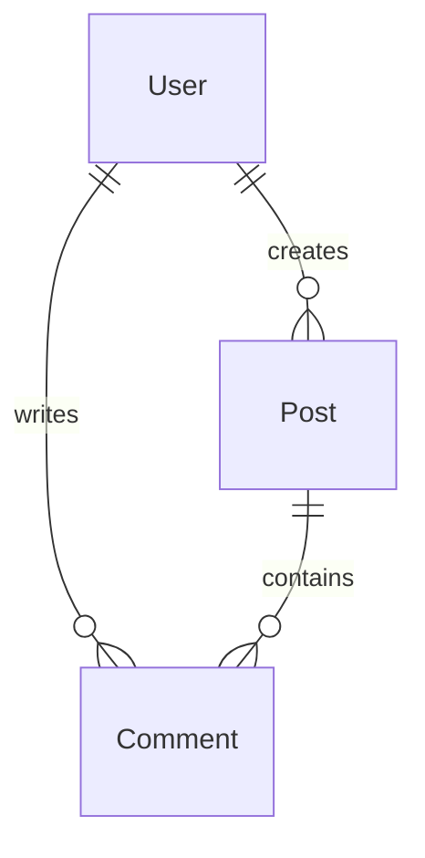

# <span style="background: #3b2b4b;color:white;padding:4px 8px;border-radius:6px;">🤖</span> AI Blog API


A REST API for an AI Blog built with **Django REST Framework**.

The project demonstrates modern backend development practices including **JWT authentication**, **role-based permissions**, **OpenAPI documentation**, **filtering**, **pagination**, and **automated testing**.

---

## 🧪 Development Tools


---

# ✨ Features

- 🔐 JWT Authentication (Access & Refresh Tokens)
- 👥 Role-Based Access Control
- 📝 CRUD for Blog Posts
- 💬 CRUD for Comments
- 🔗 Nested API Endpoints
- 🔍 Search
- 🎯 Filtering
- ↕️ Ordering
- 📄 Pagination
- 📚 Separate Read/Write Serializers
- 📖 Swagger UI Documentation
- 📘 ReDoc Documentation
- 🧪 Automated Testing with Pytest
- 📊 99% Test Coverage

---

## 🖇 Database Schema



---

# 🎨 Code Quality

The project follows a consistent coding style using:

- Black
- isort

Format the project:

```bash
black .
```

Sort imports:

```bash
isort .
```

---

# 📁 Project Structure

```text
src/
│
├── app_blog/
│   ├── management/                 # Custom Django management commands
│   ├── migrations/                 # Database migrations
│   ├── tests/                      # Automated tests
│   │   ├── conftest.py             # Shared pytest fixtures
│   │   ├── test_auth.py            # JWT authentication tests
│   │   ├── test_comments_api.py    # Comments API tests
│   │   ├── test_models.py          # Model tests
│   │   ├── test_posts_api.py       # Posts API tests
│   │   └── test_serializers.py     # Serializer tests
│   │
│   ├── admin.py                    # Django Admin configuration
│   ├── models.py                   # Database models
│   ├── permissions.py              # Custom DRF permissions
│   ├── serializers.py              # DRF serializers
│   ├── urls.py                     # API routes
│   └── views.py                    # API views
│
├── config/
│   ├── settings.py                 # Project settings
│   ├── test_settings.py            # Test settings
│   └── urls.py                     # Root URL configuration
│
├── manage.py
├── pytest.ini
└── requirements.txt
```

---

# 🚀 Installation

Clone the repository

```bash
git clone https://github.com/Olli4ka/ai-blog-api.git
```

Go to the project directory

```bash
cd ai-blog-api
```

Create a virtual environment

```bash
python -m venv .venv
```

Activate the virtual environment

### Windows

```bash
.venv\Scripts\activate
```

### Linux / macOS

```bash
source .venv/bin/activate
```

Install dependencies

```bash
pip install -r requirements.txt
```

Apply migrations

```bash
python manage.py migrate
```

Create a superuser

```bash
python manage.py createsuperuser
```

(Optional) Create default application groups

```bash
python manage.py create_groups
```

Run the development server

```bash
python manage.py runserver
```

---

# 👥 User Roles

| Role | Permissions |
|------|-------------|
| 👤 Anonymous | View posts and comments |
| 👀 Viewer | Read posts, create/edit/delete own comments |
| ✍️ Editor | Viewer permissions + create/edit/delete own posts |
| 🛡️ Admin | Full access to all posts and comments |
| ⚙️ Superuser | Full Django administrative access |

---

# 🔐 Authentication

The project uses **JWT Authentication**.

Obtain access and refresh tokens:

```http
POST /api/token/
```

Refresh an access token:

```http
POST /api/token/refresh/
```

Include the access token in authenticated requests:

```http
Authorization: Bearer <access_token>
```

---

# 📚 API Documentation

| Documentation | URL |
|--------------|-----|
| 📖 Swagger UI | `/api/docs/` |
| 📘 ReDoc | `/api/redoc/` |
| 📄 OpenAPI Schema | `/api/schema/` |

---

# 🧪 Running Tests

Run all tests

```bash
pytest
```

Run tests with coverage

```bash
coverage run -m pytest
```

View coverage in terminal

```bash
coverage report
```

Generate HTML report

```bash
coverage html
```

Open

```text
htmlcov/index.html
```

---

# 📊 Test Coverage

Current project coverage:

> **99%**

The automated tests cover:

- ✅ Models
- ✅ Serializers
- ✅ JWT Authentication
- ✅ Posts API
- ✅ Comments API
- ✅ Custom Permissions
- ✅ User Roles

---

# 🌐 Example Endpoints

| Method | Endpoint | Description |
|---------|----------|-------------|
| GET | `/api/posts/` | Retrieve all posts |
| POST | `/api/posts/` | Create a new post |
| GET | `/api/posts/{id}/` | Retrieve a post |
| PATCH | `/api/posts/{id}/` | Update a post |
| DELETE | `/api/posts/{id}/` | Delete a post |
| GET | `/api/posts/{post_id}/comments/` | Retrieve comments |
| POST | `/api/posts/{post_id}/comments/` | Create a comment |
| GET | `/api/posts/{post_id}/comments/{comment_id}/` | Retrieve a comment |
| PATCH | `/api/posts/{post_id}/comments/{comment_id}/` | Update a comment |
| DELETE | `/api/posts/{post_id}/comments/{comment_id}/` | Delete a comment |

---
# 👩‍💻 Author

**Olha Panaiot**

Backend Developer (Python | Django | Django REST Framework)

---

⭐ If you found this project interesting, feel free to star the repository.